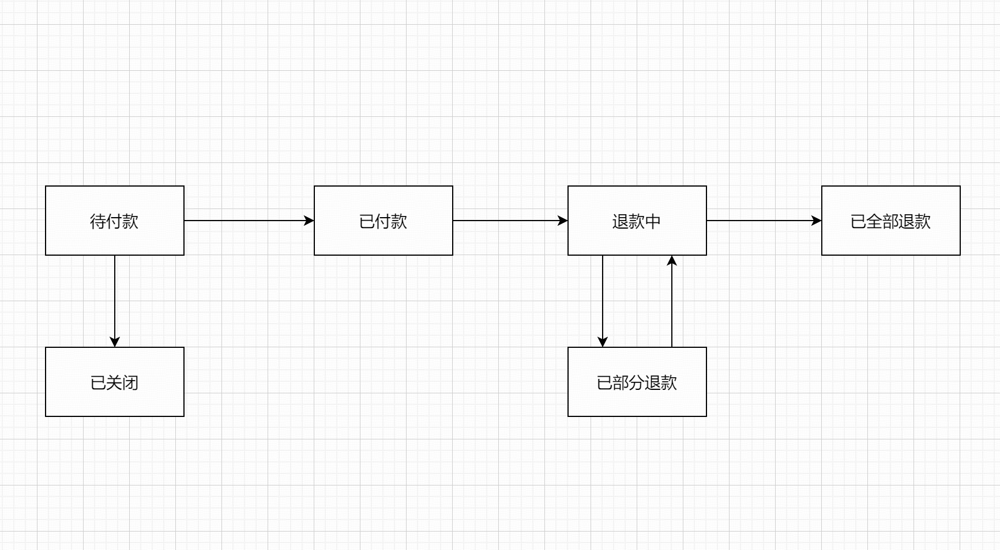

# 订单部分生命周期

## 1. 订单生命周期设计概述

订单生命周期设计包含六个主要状态：待付款（A）、已关闭（B）、已付款（C）、退款中（D）、已部分退款（E）和已全部退款（F）。每个状态之间存在明确的转换规则，确保订单处理过程的顺畅和准确性。

## 2. 订单生命周期流程图

## 3. 订单状态及转换规则详述

### 3.1 待付款（A）

- **描述**：订单创建后，处于等待用户支付的状态。
- **状态转换**：
  - 用户未付款并取消订单，则订单进入已关闭状态（B）。
  - 用户完成支付，则订单转为已付款状态（C）。

### 3.2 已关闭（B）

- **描述**：订单未付款时，用户取消订单。
- **状态转换**：无

### 3.3 已付款（C）

- **描述**：用户已完成支付，订单处于已付款状态。
- **状态转换**：
  - 用户发起退款，则订单转为退款中状态（D）。

### 3.4 退款中（D）

- **描述**：订单发起退款申请，等待退款处理。
- **状态转换**：
  - 若部分退款，则订单转为已部分退款状态（E）。
  - 若全部退款，则订单转为已全部退款状态（F）。

### 3.5 已部分退款（E）

- **描述**：订单中的部分金额已退款成功。
- **状态转换**：
  - 用户继续申请退款，则订单重新进入退款中状态（D）。

### 3.6 已全部退款（F）

- **描述**：订单中的全部金额已退款成功。
- **状态转换**：无

