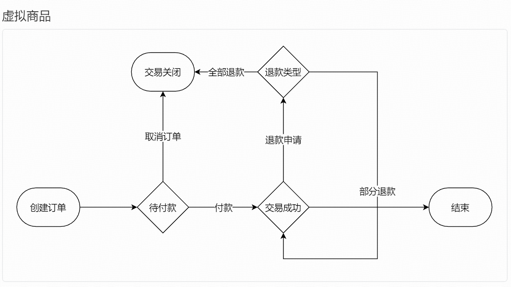
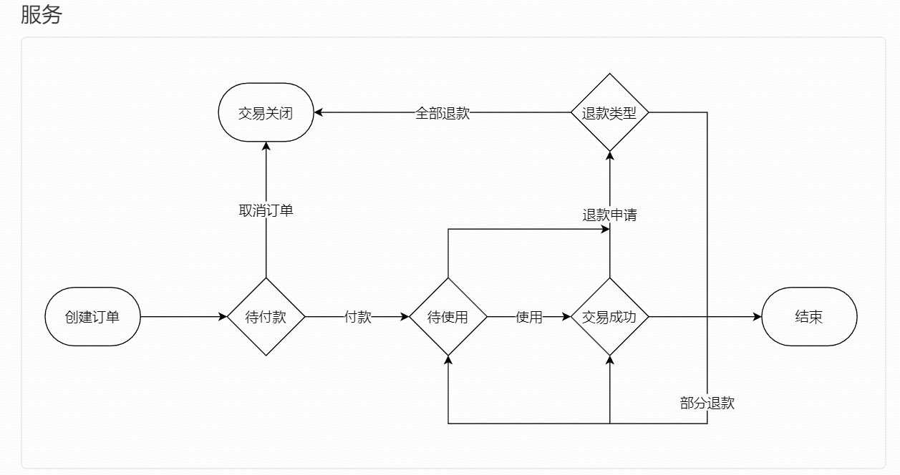
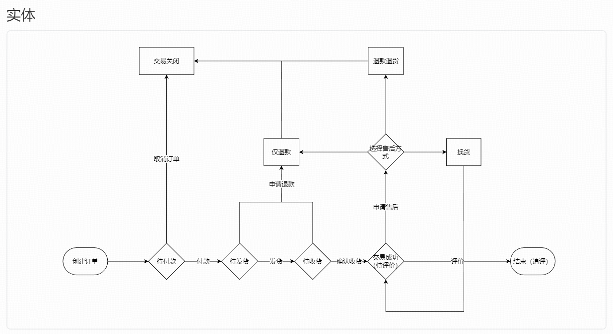

# 订单生命周期

## 虚拟商品订单流程

### 状态表：

创建订单，待付款，交易关闭，交易成功，退款类型选择，结束

### 状态转移：

#### 创建订单，进入待付款状态

待付款状态有两个选择：
1. 取消订单，进入交易关闭状态；
2. 付款，进入交易成功状态

交易成功状态有两个选择：
1. 申请退款，进入退款类型选择状态；
2. 什么也不做，结束状态

#### 退款类型选择状态

退款类型有两个选择：
1. 全部退款，进入交易关闭状态；
2. 部分退款，进入交易成功状态 

## 服务类型订单流程

### 状态表：

创建订单，待付款，交易关闭，交易成功，退款类型选择，结束，待使用

### 状态转移：

#### 创建订单，进入待付款状态

待付款状态有两个选择：
1. 取消订单，进入交易关闭状态；
2. 付款，进入待使用状态

#### 待使用状态

待使用状态有两个选择：
1. 申请退款，进入退款类型选择；
2. 使用，进入交易成功状态

#### 交易成功状态

交易成功状态有两个选择：
1. 申请退款，进入退款类型选择状态；
2. 什么也不做，结束状态

##### 退款类型选择状态

退款类型有两个选择：
1. 全部退款，进入交易关闭状态；
2. 部分退款，根据原状态进入交易成功状态或待使用状态 

## 实体类型订单流程

### 状态表：

创建订单，待付款，交易关闭，交易成功，售后方式选择，结束，待发货，待收货，仅退款，退货退款，换货

### 状态转移：

#### 创建订单，进入待付款状态

待付款状态有两个选择：
1. 取消订单，进入交易关闭状态；
2. 付款，进入待发货状态

#### 待发货状态

待发货状态有两个选择：
1. 申请退款，进入仅退款状态；
2. 发货，进入待收货状态

#### 待收获状态

待收获状态有两个选择：
1. 申请退款，进入仅退款状态；
2. 确认收获，进入交易成功状态

#### 交易成功状态

交易成功状态有两个选择：
1. 申请售后，进入售后方式选择状态；
2. 什么也不做，结束状态

##### 售后方式选择状态

售后方式选择有三个选择：
1. 进入仅退款状态；
2. 进入退货退款状态；
3. 进入换货状态

###### 仅退款状态

进入交易关闭状态 

###### 退款退货状态

进入交易关闭状态 

###### 换货状态

进入交易成功状态 

